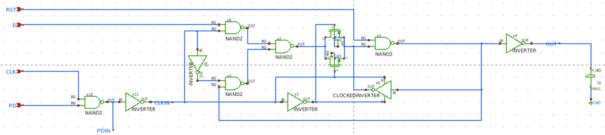
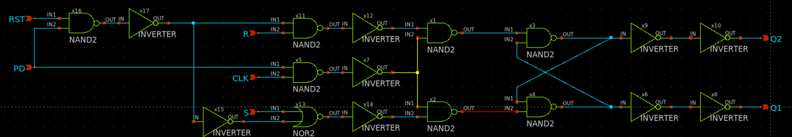
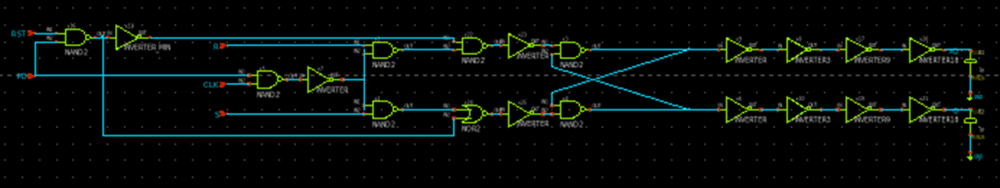

# readme

Ricoho035
- LR課題テスト課題
-検証内容と設計の流れ
-Latch回路の設計（初期）
土屋さんのコメントからクロックドＣＭＯＳインバータを使ったラッチ回路の設計を行った

回路動作、出力遅延(H⇒L) 、出力遅延(L⇒H)、消費電流、スタンバイ電流の検証を行った。
-９月の報告時点では、遅延時間、PD＝HIGHの出力、出力L電圧及び出力H電圧の測定ができていなかった。また、比較機（穂刈担当）と組み合わせたときに正常に動作しなかった。（スイッチの抵抗が原因）
-上記を踏まえ改めてクロックドＣＭＯＳを使わずＳＲラッチで設計を行うこととなった。またリングオシレータを用いて最小遅延時間の測定に取り組んだ。
-Latchの設計（改善）
初期の反省点から新たにSRラッチ回路の設計を行った。出力L電圧及び出力H電圧を満たすためにバッファ回路を取り付け以下のような回路を設計した。

-11月の報告時点では要求された項目を満たすことができた。出力L電圧及び出力H電圧を満たすためにバッファ回路の出力側のインバータのサイズを１８倍に設計を行った。
-谷本先生からの指摘で回路設計に無駄があることがわかった。いらない部分を削ってコンパクトな設計が求められる。また、バッファ回路において急に１８倍にするのは効率が悪く３倍づつにするのが最も効率が良いことが分かった。
-Latchの設計（現行）
上記の改善また、上下のバランスを考え、下記のSRラッチ回路を設計した。

-1月の報告時点では回路設計は完了し、レイアウト設計に取り組み始めた。

ファイル構成
./LR
├── LR_hasegawa/   #メインの動作環境フォルダ
├── outdata/       # ゴミ置き場フォルダ（経過途中のファイルなど）
├── Documents/     # まとめデータフォルダ
├── src/           # 報告資料フォルダ
├── scripts/       # GNUplotや解析用スクリプト
├── layout/        # KLayout (GDSII) ファイル
├── T_MOS_model.sp # スパイスモデルファイル
└── README.md